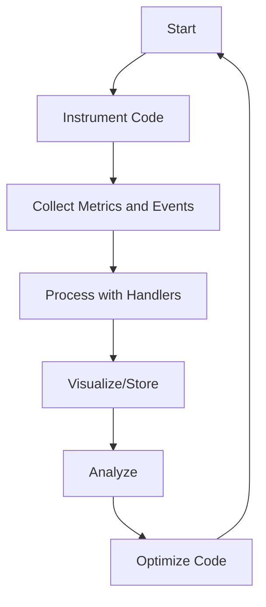
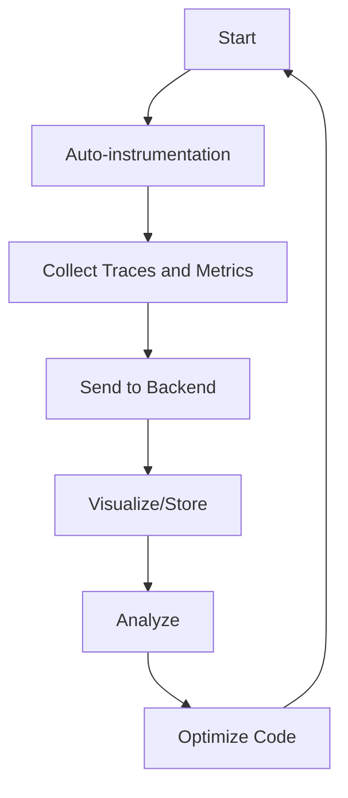

# Elixir Telemetry and OpenTelemetry

## Plan
1. Training
2. Telemetry in Demo Apps   (Local Machine)
5. Telemetry in IB          (In a FTE - Dockerised Functional Test Envinroment)
3. Telemetry in Tauspace    (Standardised Pipeline for Telemetry in Tauspace Apps )
4. Telemetry in RAIN        (Telemetry setup and tested in Rain SIT environment)

## Pre-work 
Docker -> Do the training on the Docker App quickly. Read through and understand the basics so that you can get the app running.

## Telemetry Project

### Project - Definition of Done
- Research and learning on Telemetry and OpenTelemetry. (including sample apps and demos)
- Get basic telemetry system working on a mini app
- Get end-to-end telemetry system working in  self-contained IB (in a ) using Opentelemetry: Phoenix, Ecto, cowboy.
- Standardized architecture for setting up telemetry in a Tauspace Project
- Create a phased deployment strategy for integrating telemetry into IB in production.
- Notifications system
- Log management
- Define coding standard for Tauspace
- Define business objects method
- AWS opensearch working with sample projects - feeding in telemetry from: Phoenix, Etco, Application, Traces
- AWS open search (Kibana) - get tutorials working
- On premise - Elastic search + Grafana or Kibanan

### Tutorial 1: Elixir Conf 2021 - Telemetry and Observability in Elixir - Kamil Kowalski:
#### Context Setting - All team members
https://www.youtube.com/watch?v=4OBtc_eIKIE
https://github.com/kamilkowalski/opentelemetry-demo
https://drive.google.com/file/d/1oNUli4gvUmP56UPTa3fvRELi9ahlM3fr/view

### Tutorial 2: OpenTelemetry Demo

Get this running, and observe the different areas.
Go through the code and understand what is happening.

https://opentelemetry.io/docs/erlang/getting-started/
https://opentelemetry.io/docs/demo/

### Tutorial 3: Elixir School Telemetry Tutorial
#### Getting telemetry working for Phoenix
#### How woud we instrument phoenix to get telemetry working? all the way through to Opensearch
#### Do Parts 1 - 4
- https://elixirschool.com/blog/instrumenting-phoenix-with-telemetry-part-one
- https://elixirschool.com/blog/instrumenting-phoenix-with-live-dashboard

### Tutorial 4: Elixir School - Telemetry
https://elixirschool.com/en/lessons/advanced/telemetry/

### Tutorial 5:  Telemetry
https://blog.miguelcoba.com/series/elixir-telemetry

### OpenSearch

https://opensearch.org/docs/latest/opensearch/install/docker/

## Introduction

Telemetry and observability are critical tools for the modern software development landscape. These tools offer invaluable insights that are essential for effective debugging, monitoring, and performance optimization. In an era where software applications are increasingly complex and distributed, having real-time insights into the behavior and performance of your application is not just an added advantage—it's a requirement. 

----------

## Prerequisites

Before embarking on this learning path, it's imperative to have a solid understanding of Elixir and the OTP (Open Telecom Platform) framework. This foundational knowledge will serve as the basis upon which you'll build your telemetry and observability skills. Additionally, a rudimentary understanding of distributed systems and microservices architecture will be highly beneficial, as these are the types of environments where telemetry and observability are most crucial.

----------

## Essential Reading

https://samuelmullen.com/articles/the-hows-whats-and-whys-of-elixir-telemetry

## Introduction to Telemetry

### What is Telemetry?

Telemetry is the automated process of collecting data from various components of a system and transmitting it to a centralized location for analysis. In software systems, this data can range from system metrics like CPU usage, memory allocation, and network latency to events such as user logins, system errors, and database queries.

**Types of Data**:

-   **System Metrics**: CPU usage, memory allocation, network latency
-   **Events**: User logins, system errors, database queries

**Reading**: [Introduction to Telemetry](https://www.sumologic.com/glossary/telemetry/)

### Telemetry in Elixir

In Elixir, the Telemetry library serves as a dynamic dispatching library for metrics and events. It allows you to instrument your code with custom events and metrics, which can then be processed by various handlers for logging, monitoring, or other forms of data analysis.

**Key Concepts**:

-   **Instrumentation**: Adding code to collect custom events and metrics.
-   **Handlers**: Processes that receive telemetry data for logging, monitoring, or other forms of analysis.

**Reading**: [Telemetry Events and Metrics in Elixir](https://hexdocs.pm/telemetry/events_and_metrics.html)

----------

## Deep Dive into Elixir Telemetry

### Metrics and Events

Metrics are quantitative measurements that provide a snapshot of your system at any given time. These could include latency, error rates, or throughput. Events, on the other hand, are significant occurrences within your system that you may want to monitor, such as a user login or a system failure.

**Metrics**: Quantitative measurements like latency, error rates, or throughput.

**Events**: Significant occurrences such as a user login or a system failure.

**Reading**: [Telemetry Metrics](https://hexdocs.pm/telemetry_metrics/Telemetry.Metrics.html)

### Telemetry Poller

Telemetry Poller is a specialized package in Elixir that periodically gathers metrics from the Erlang VM and other sources. This is particularly useful for collecting metrics that are not event-driven but need to be sampled at regular intervals, such as memory usage or CPU utilization.

**Purpose**: To periodically gather metrics from the Erlang VM and other sources.

**Common Metrics**:

-   Memory usage
-   CPU utilization

**Reading**: [Telemetry Poller Documentation](https://hexdocs.pm/telemetry_poller/readme.html)

### Additional Topics

1.  **Telemetry Reporters**: These libraries help you visualize or store the metrics you've collected. Examples include `Telemetry.Metrics.ConsoleReporter` and `Telemetry.Metrics.Prometheus.Core`.
2.  **Dynamic Telemetry**: This involves attaching and detaching telemetry handlers at runtime, allowing for more flexible monitoring strategies.
3.  **Telemetry Attachments**: Learn how to use `:telemetry.attach/4` to attach functions to telemetry events dynamically.

1.  **Telemetry Reporters**: Libraries for visualizing or storing metrics.
2.  **Dynamic Telemetry**: Attaching and detaching telemetry handlers at runtime.
3.  **Telemetry Attachments**: Using `:telemetry.attach/4` for dynamic event handling.

**Reading**: 

[Telemetry Reporter Libraries](https://hexdocs.pm/telemetry/reporter_libraries.html)

[Dynamic Telemetry in Elixir](https://hexdocs.pm/telemetry/dynamic.html)

----------

### Introduction to OpenTelemetry

### What is OpenTelemetry?

OpenTelemetry is an open-source observability framework designed for cloud-native software. It provides APIs, libraries, agents, and instrumentation for distributed tracing and metrics collection.

**Features**: 
-   APIs
-   Libraries
-   Agents
-   Instrumentation

**Reading**: 
[OpenTelemetry Overview](https://opentelemetry.io/docs/concepts/)
[OpenTelemetry Elixir Erlang Docs](https://opentelemetry.io/docs/instrumentation/erlang/)
[OpenTelemetry Elixir Github](https://github.com/open-telemetry/opentelemetry-erlang)
[OpenTelemetry API Reference](https://hexdocs.pm/opentelemetry_api/api-reference.html)
[Erlang OTP Design Principles](https://www.erlang.org/doc/design_principles)

### OpenTelemetry in Elixir

OpenTelemetry provides a more comprehensive solution for observability. It offers auto-instrumentation features, meaning it can automatically collect traces and metrics without requiring you to modify your existing codebase significantly.

**Key Features**:

-   **Auto-instrumentation**: Automatically collect traces and metrics.
-   **Custom Spans and Traces**: For specific workflows in your application.

**Reading**: [Getting Started with OpenTelemetry in Elixir](https://opentelemetry.io/docs/erlang/getting-started/)

### OpenTelemetry and Elixir Telemetry:

#### Similarities

-   **Metrics Collection**: Both Elixir Telemetry and OpenTelemetry are capable of collecting metrics to monitor the performance of your application.
-   **Event-based**: Both are event-based systems, meaning they react to events that occur within your application to collect data.

#### Differences:

-   **Native to Elixir vs Cross-language**: Elixir Telemetry is native to the Elixir language, whereas OpenTelemetry is a cross-language standard.
-   **Tracing**: OpenTelemetry supports tracing to track the flow of requests through various services, while Elixir Telemetry does not have built-in support for tracing.
-   **Overhead**: Elixir Telemetry is designed to have low overhead, making it lightweight and efficient. OpenTelemetry, being more feature-rich, tends to have a higher overhead.
-   **Instrumentation**: Elixir Telemetry allows for custom instrumentation tailored to your application. OpenTelemetry, being a standard, comes with a set of standard instrumentation protocols.

### When to Use Which:

#### Use Elixir Telemetry When:

1.  **You're Working Solely in Elixir**: If your entire stack is in Elixir, using a native tool can be more efficient.
2.  **Low Overhead is Crucial**: For applications where performance is a key concern, the low overhead of Elixir Telemetry can be beneficial.
3.  **Custom Instrumentation**: If you need to tailor your metrics and events very specifically to your application, Elixir Telemetry provides more flexibility.

#### Use OpenTelemetry When:

1.  **Cross-Language Support is Needed**: If your application involves multiple languages or services written in different languages, OpenTelemetry provides a unified standard.
2.  **Tracing is Required**: For microservices architectures or complex systems where tracing the flow of requests is important, OpenTelemetry is the better choice.
3.  **Standardization**: If you aim for a standardized way of collecting metrics and traces that can be understood across different teams or even different companies, OpenTelemetry is more suitable.

## OpenSearch

----------

OpenTelemetryPhoenix
OpenTelemetry Cowboy
OpenTelemetry Ecto
https://hexdocs.pm/opentelemetry_ecto/OpentelemetryEcto.html

## Advanced Topics and Best Practices

### Distributed Tracing

Distributed tracing is a technique used to profile and monitor applications, especially those built using a microservices architecture. It helps you understand how a single request flows through your complex system of microservices.

**Reading**: [Distributed Tracing in OpenTelemetry](https://opentelemetry.io/docs/concepts/distributed-tracing/)

### Best Practices

Understanding the best practices can help you make the most out of your telemetry setup. This includes guidelines on what metrics to collect, how to name them, what their cardinality should be, and how to handle errors and exceptions.

**Reading**: [OpenTelemetry Best Practices](https://opentelemetry.io/docs/practices/)

**Reading**: [Building Observability Into Your Elixir Project](https://www.erlang-solutions.com/blog/building-observability-into-your-elixir-project.html)

----------

## Diagrams

1.  **Elixir Telemetry Workflow**:

2. **OpenTelemetry Workflow**:

Logical Architecture 
3 parts Producer, Processing, Console (Display+search)

DOD
 - Get onprem telemetry system working 

Define coding standard for Tauspace 
Define business objects method

AWS opensearch working with sample projects - feeding in telemetry from:
Phoenix 
Etco 
Application - Chicken 
Traces 
Deploy plan for RAIN 
Deploy V1 to RAIN 

AWS open search (Kibana) - get tutorials working 
On premise - Elastic search + Grafana or Kibanan 

Elixir Telemetry module 
Ecto telemetry 
Phoenix Telemetry  
Blog Elixir schools 
Core telemetry elements
Log management
Notifications 

RAIN tie back
IB tie back  
